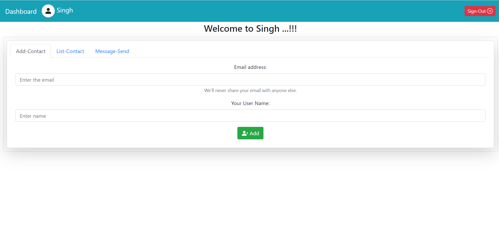

# Gmail Webapp
Web application using Vue.js, Node.js and MySQL2.

Website: 'https://nodejs-gmail.herokuapp.com/'

+ How to run on backend:
	+ cd `backend`
	+ npm run `develop`
	+ localhost: 4000

+ Layouts:

