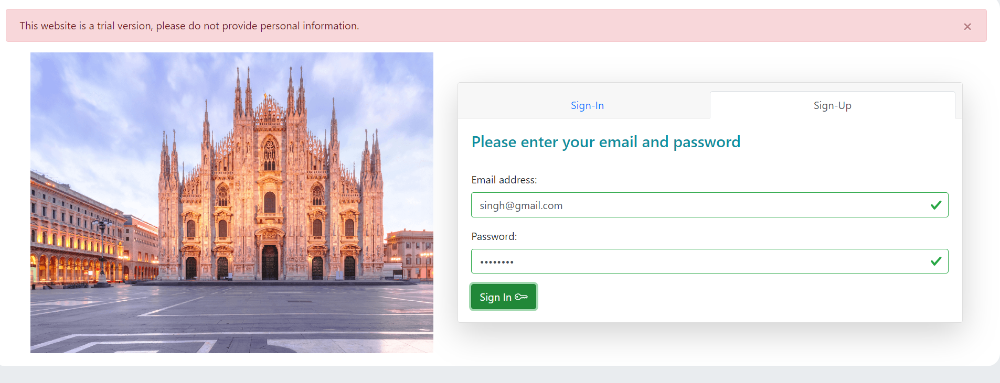
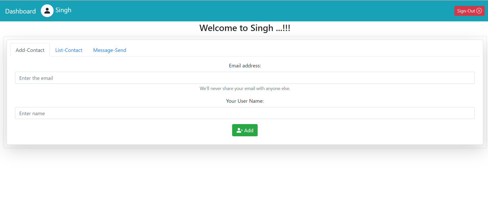
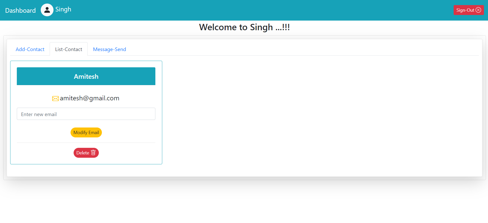
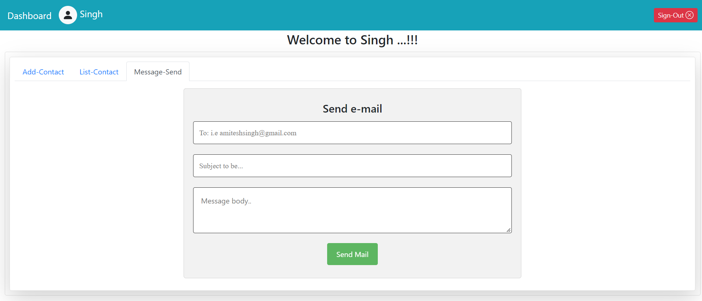

# Gmail Webapp
Web application using Vue.js, Node.js and MySQL2.

+ How to run on frontend
	+ cd `frontend`
	+ npm run `develop`
	+ localhost: 8080

+ Layouts:






+ Test cases
	+ Alligator-test folder contain all files related to test case
	+ ```npm run test``` - this command, it will update everytime whenever test.js modify
