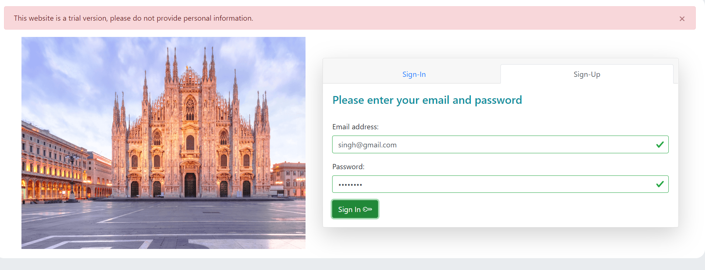
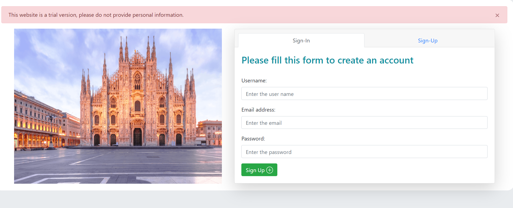
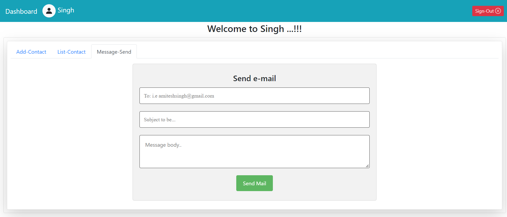

# Gmail Webapp
Web application using Vue.js, Node.js.

+ How to run the application
	+ cd `Frontend`
	+ npm run `build`
	+ copy `dist` folder to `Backend`
	+ cd `Backend`
	+ npm run `dev`

## Getting Started

** Run 2 sub-projects(Frontend and Backend) using this bash command **

```bash
npm run dev 
```

+ ```npm run dev``` - this command, it will update everytime whenever modify file 

## Routes

+ Endpoint Authentication -
	+ POST ```localhost:4000/auth/signUp```  - create a new user
	+ POST ```localhost:4000/auth/signIn```  - login credential 

+ Endpoint Contacts -
	+ GET ```localhost:4000/contact/:id```  - get a particular contact list which attached with user id
	+ POST ```localhost:4000/contact/addNewContact```  - create a new list of contacts

+ Endpoint Users -
	+ GET ```localhost:4000/users/:id```  - get user details with that id
	+ PUT ```localhost:4000/users/:id, payload```  - modify user mail with that id
	+ DELETE ```localhost:4000/users/:id``` - delete particular user email id

+ Endpoint Send Mail - 
	+ POST ```localhost:4000/sendMail```  - send mail to list of all contacts connected with that user

+ Extra routes -
	+ GET ```localhost:4000/all``` - get all users with this endpoint
	+ GET ```localhost:4000/emails``` - get all emails with users connected using this endpoint
	+ GET ```localhost:4000/names``` - get all names with users connected using this endpoint
	+ POST ```localhost:4000/createDB``` - create a new database using endpoint
	+ DELETE ```localhost:4000/db/:dbName``` - delete database which use this database name
		
## Frontend 
+ Run this command to test the scenario
+ alligator-test folder contain test cases
+ ```npm run test``` - this command, it will update everytime whenever test.js modify

+ Share the layout, it will look like this.
+ Layouts:





